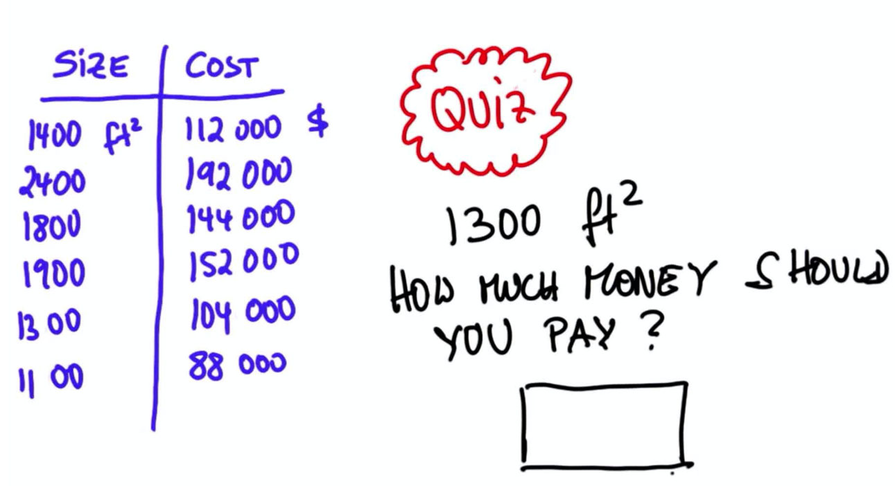

### Source

This exercise was inspired by an article on medium.com.

Since the tutorial was written for python users, I decidwd to do an equivalent analysis in R.

[Click Here](https://towardsdatascience.com/intro-to-statistics-looking-at-data-1-23c49ef2bbd8)"Intro to Statistics"


### Interview for a data scientist job

Here is a challenge. Given the data, create a model that predicts the cost of a 1300 square feet house. 

If you are given 2 days to find an answer, using R, could you do it?




### Create a dataframe with the data

```{r}
size <- c(1400,2400,1800,1900,1300,1100)
cost <- c(112000,192000,144000,152000,104000,88000)
data <- data.frame(size,cost)
```
### Create a scatterplot

```{r}
scatter.smooth(data$size,data$cost,
     xlim = c(1000,2600),
     ylim = c(80000,200000))
```

# What model to try?

The scatteplot shows that the data points lie on a straight line, so simple linear regression will be an excellent model to try.

In statistics, linear regression is a linear approach to modelling the relationship between a scalar response (or dependent variable) and one or more explanatory variables (or independent variables). The case of one explanatory variable is called simple linear regression.

```{r}
model <- lm(cost ~ size,data=data)
plot(data$size,data$cost,
     xlim = c(1000,2600),
     ylim = c(80000,200000))
abline(lm(cost ~ size,data=data))
abline(v=1300, col = "blue")
```

# GLM

```{r}
model_glm <- glm(cost ~ size,data=data)
```
# Check data for outliers

```{r}
par(mfrow=c(1, 2))
boxplot(data$size, main = "size")
boxplot(data$cost,main = "cost")

# There are no outliers
```
### Model details

```{r}
model$coefficients
```

### Predicted price for house size = 1300 square feet

```{r}
Pred_1300 <- model$coefficients[1]+
  (model$coefficients[2] * 1300)
Pred_1300
```

### Model interpretation

```{r}
summary(model)
```

Is this exercise too simple to be useful?

1. Who would do a regression on a sample size of only 6?
2. The model predicted values are perfect, with no error. (All the data points lie exactly on the prediction line). Thus the R sqrared value = 1. This never happens with real data. It has been said that there are no good models, only useful ones.

Here are assumptions that should be chekced for serious analysis and to respond to your critics:

1. The regression model is linear in parameters.
2. The mean of residuals is zero.
3. Homoscedasticity of residuals or equal variance.
4. No autocorrelation of residuals.
5. The X variables and residuals are uncorrelated.
6. The number of observations must be greater than number of Xs.
7. The variability in X values is positive.
8. The regression model is correctly specified/
9. No perfect multicollinearity.
10. Normality of residuals.
11. The data points are independent.

### Model Diagnostics

```{r}
plot(model$residuals)
abline(h=0, col = "red")
round(mean(model$residuals))
plot(model)
cor.test(data$size, model$residuals)
# p-value is high, so null hypothesis that true correlation is 0 can’t be rejected
var(data$size)  
# The variance in the X variable is much larger than 0. So, this assumption is satisfied.
influence.measures(model)
```

### AIC and BIC

The Akaike’s information criterion - AIC (Akaike, 1974) and the Bayesian information criterion - BIC (Schwarz, 1978) are measures of the goodness of fit of an estimated statistical model and can also be used for model selection. Both criteria depend on the maximized value of the likelihood function L for the estimated model. For model comparison, the model with the lowest AIC and BIC score is preferred.

```{r}
AIC(model)  
BIC(model)
```


### Package for diagnostics = gvlma

```{r}
# install.packages("gvlma")
# Global validations of linear model assumptions
library(gvlma)
gvlma::gvlma(model)
```

# Comment

Ordinary Least Squares (OLS) also known as Simple Linear Regression is an important foundation upon which data science is built.

It certainly does not appear to be as simple today as it was almost 50 years ago, when I first learned about it.

The internet is a great resource for finding answers to questions and uncovering even more questions.

How does one become a world-class tennis player? Practice...practice...practice. The same goes for data science.

Keys to success:

1. Don o don, tolo be ta kalanso.
2. Woshi ji.


[Click Here](http://r-statistics.co/Assumptions-of-Linear-Regression.html)"Assumptions of Linear Regression"

[Click Here](http://r-statistics.co/Linear-Regression.html)"Linear Regression"