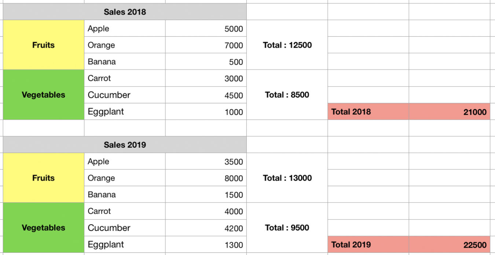
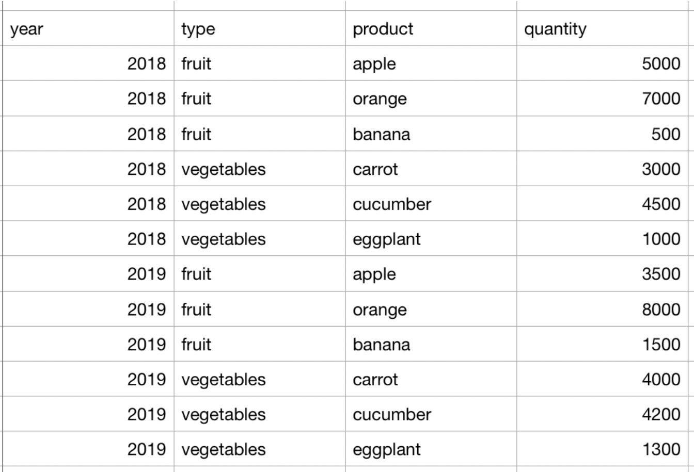

[Click Here](https://towardsdatascience.com/microsoft-excel-in-the-era-of-big-data-401e67ca28a5)"Excel in the era of big data"

# Spreadsheets 

Most people with computers use them. But few use them well. Introduced in 1980, VisiCalc was the first "killer" application for personal computers. Today there are many,many choices. Excel captures about 85% of the market. OPenOffice Calc and LibreOffice Calc are two popular platforms.

Question: At what grade level are spreadsheeet introduced in school? Probably not early enough.

Data scientists spend up to 80% of their time wrangling dirty data into a usable format. This drudgery could be greatly reduced if people who present data in spreadsheets are taught that humans and computers have different requirements for interpretability.

Here is a data format that humans can understand.



And here is a format of the same data that computers can understand.



Thequestion is: How do we get from Dirty to Tidy? 

The first challenge is scraping the data from the URL.

Here is how I did it.

1. Copy the image of the data with the screencapture function (Command+Shift+4) on the Mac.
2. Save to clipboard.
3. Load the image into Photoshop.
4. Save to a jpg file.

[Click Here](https://www.onlineocr.net)"Online OCR"

5. Transform the file from jpg to xlsx.
   a. Online Optical Character Recognition software
   b. Upload the jpg file and download the xlsx file.
   c. Load the xlsx filel into Excel.
   d. Save it to a csv file without any tweaking.
   
6. Now load the cv file into R.

```{r}
dirty <- read.csv("Dirty_Excel.csv",
        stringsAsFactors = FALSE)
dirty
```

### OUCH!. This is even dirtier than the original.

Why didn't I clean the file in Excel. I want my wrangling to be reproducible by anyone. This is easy if all the transformations are done with R code.

### So now let's do some tidying.

```{r}
tidy <- data.frame(year = c(rep(2018,6),
        rep(2019,6)))
tidy$type <-c(rep(dirty$Sales.2018[20],3),
   rep(dirty$Sales.2018[22],3), 
   rep(dirty$Sales.2018[20],3),
  rep(dirty$Sales.2018[22],3))
tidy$product <- c(dirty$Sales.2018[1:6],
    dirty$Sales.2018[9:14])
tidy$quantity <- c(dirty$X[1:6],
    dirty$X[9:14])
tidy
```

### Exploratory Data Anaalysis (EDA)

```{r}
dim(tidy)
names(tidy)
anyNA(tidy)
str(tidy)
summary(tidy)
```

### Now for some analysis

```{r}
suppressMessages(library(dplyr))
suppressMessages(library(formattable))
by_group <- tidy %>% group_by(year,type)
table_1 <- by_group %>% summarize(total = sum(quantity))
formattable(table_1, align =c("c","c","c"))
by_year <- tidy %>% group_by(year)
table_2 <- by_year %>% summarize(total = sum(quantity))
formattable(table_2, align =c("c","c"))
```

[Click Here](https://www.littlemissdata.com/blog/prettytables)" Using Formattable"

```{r}
library(linguisticsdown)
library(htmlwidgets)
voila <- "voila.gif"
include_graphics2(voila)
```

# Chose dite...chose faite.
